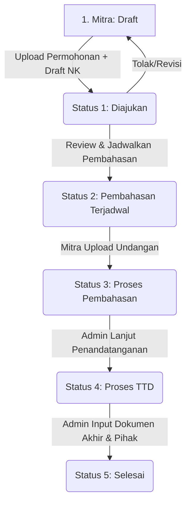

# Sistem Manajemen Kerja Sama (SMS) - Pusdatin Kemendikdasmen

Aplikasi manajemen kerja sama antara **Pusdatin Kemendikdasmen** dengan berbagai mitra (seperti pemerintah daerah, instansi, perguruan tinggi, dll).

Aplikasi ini dibangun menggunakan arsitektur **Server-Side Rendering (SSR)** yang ringan dan responsif, sepenuhnya bebas dari dependensi Filament/Livewire.

---

## 🛠️ Tech Stack

- **Framework:** Laravel 13 (PHP 8.3+)
- **Database:** Microsoft SQL Server (via driver `sqlsrv` PHP)
- **Frontend:** Laravel Blade + Tailwind CSS v4 (via Vite) + Alpine.js
- **Assets Bundler:** Vite 8.0 & `@tailwindcss/vite`
- **Storage:** Local (public disk)

---

## 📋 Prasyarat Sistem

Sebelum menjalankan aplikasi, pastikan komputer Anda telah terinstal:
- PHP 8.3+
- Composer (v2.x)
- Node.js (v20+ & NPM)
- SQL Server (2017+) dengan driver `sqlsrv` PHP terinstal
- Microsoft ODBC Driver 18 for SQL Server

---

## 🚀 Panduan Instalasi & Setup Cepat

Ikuti langkah-langkah di bawah untuk memasang projek secara lokal:

### 1. Clone & Masuk ke Direktori
```bash
git clone <repo-url>
cd ProjekKP
```

### 2. Jalankan Script Setup Otomatis
Projek ini menyediakan perintah otomatis untuk menginstal dependensi PHP & JS, menyalin berkas `.env`, membuat aplikasi key, dan migrasi database:
```bash
composer run setup
```

### 3. Sesuaikan Konfigurasi Database (.env)
Buka berkas `.env` yang baru terbuat dan sesuaikan konfigurasi koneksi SQL Server Anda:
```env
DB_CONNECTION=sqlsrv
DB_HOST=127.0.0.1
DB_PORT=1433
DB_DATABASE=nama_database_anda
DB_USERNAME=sa
DB_PASSWORD=password_db_anda
DB_TRUST_SERVER_CERTIFICATE=true
```

---

## 💻 Cara Menjalankan Projek

Jalankan perintah berikut di terminal untuk memulai server pengembangan:
```bash
composer dev
```
> [!NOTE]  
> Perintah `composer dev` akan otomatis menjalankan server Laravel (`artisan serve`), bundler aset (`vite dev`), queue listener, dan logging pail secara bersamaan dalam satu terminal menggunakan `concurrently`.

---

## 🔐 Hak Akses & Fitur Halaman (Role)

| Role | Akses URL | Fitur & Deskripsi |
|------|-----------|-------------------|
| **Mitra** | `/mitra` | Mengajukan Nota Kesepakatan baru, mengunggah dokumen/surat permohonan, mengunggah surat undangan pembahasan, serta memantau progres pengajuan. |
| **Admin** | `/admin` | Dashboard khusus untuk mereview pengajuan mitra, membuat jadwal pembahasan, menginput data arsip kerja sama, serta melakukan finalisasi dokumen. |

---

## 🔄 Alur Proses Nota Kesepakatan (NK)



1. **Mitra: Draft** 
   Mitra mengunggah Surat Permohonan & Draft NK. Status berubah menjadi **Diajukan** (Status 1).
2. **Admin: Review & Penjadwalan**
   Admin memeriksa berkas dan menentukan jadwal pembahasan. Status berubah menjadi **Pembahasan Terjadwal** (Status 2).
3. **Mitra: Upload Undangan**
   Mitra mengunggah Surat Undangan Pembahasan resmi. Status otomatis berubah menjadi **Proses Pembahasan** (Status 3).
4. **Admin: Proses Penandatanganan**
   Setelah kesepakatan selesai dibahas, Admin memajukan status ke **Proses Penandatanganan** (Status 4).
5. **Admin: Finalisasi**
   Admin memasukkan data pihak-pihak terkait, perihal, masa berlaku, dan dokumen NK yang telah ditandatangani. Status menjadi **Selesai** (Status 5).

---

## 📊 Struktur Status Dokumen

| ID | Nama Status |
|----|-------------|
| **1** | Mengirimkan surat permohonan |
| **2** | Pemohon menyampaikan undangan pembahasan NK/PKS/NDA |
| **3** | Dokumen dalam proses pembahasan |
| **4** | Dokumen dalam proses penandatanganan |
| **5** | Dokumen telah ditandatangani dan diterima oleh masing-masing Pihak |
| **6** | Masa berlaku selesai |

---

## 🛠️ Penyelesaian Masalah (Troubleshooting)

### Error: `Please provide a valid cache path`
Jika Anda menemui error ini setelah berpindah branch atau melakukan instalasi awal, jalankan perintah berikut di terminal:
```bash
mkdir -p storage/framework/sessions storage/framework/views storage/framework/cache/data
```
Hal ini dikarenakan Git secara bawaan mengabaikan folder kosong tempat penyimpanan cache rendering Laravel.

---

## 📄 Lisensi

Proprietary — Hak Cipta Internal **Kemendikdasmen**.
